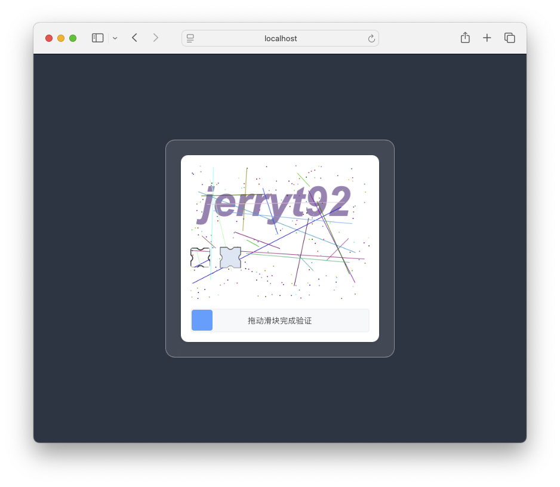

简体中文 | [English](README_en.md)

# Simple Slip Captcha

一个基于Java Spring Boot + Vue3 的简单滑动验证码

## 项目简介

Simple Slip Captcha 是一个提供滑动验证码功能的项目，使用Spring Boot + Vue3框架构建。使用简单，该项目可以生成简单滑动验证码，用于简单的网站或应用的身份验证流程中。

⚠️**注意：该项目未做行为模型检测，仅仅是简单的坐标偏移量检测和轨迹验证，请勿用于高安全性要求的场景中。**

## 技术栈

- Java 8+
- Spring Boot
- Maven
- Vue3

## 特性

- 主要组件原生DOM实现，可方便移植至其它前端框架中。
- 适配Touch事件，可兼容移动设备。
- 图片分辨率、文字内容、噪声纹理密度、色彩等可灵活配置。

## 效果图
 

## 环境要求

- JDK 8 或更高版本

## 许可证

MIT