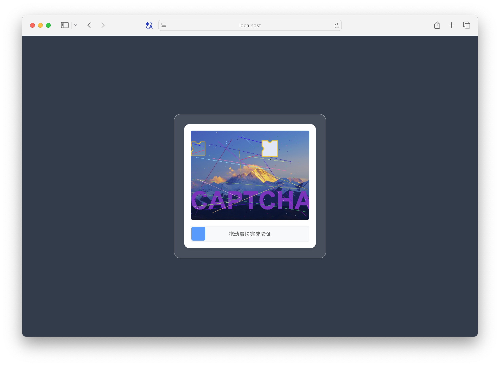

[简体中文](README.md) | English

# Simple Slip Captcha

A simple sliding captcha based on Java Spring Boot + Vue3.

## Project Overview

Simple Slip Captcha is a project that provides sliding captcha functionality, built with Spring Boot + Vue3 framework. It's easy to use and can generate simple sliding captchas for basic authentication processes in websites or applications.

⚠️**Note: This project has not undergone rigorous security validation and should not be used in scenarios requiring high security.**

## Tech Stack

- Java 8+
- Spring Boot
- Maven
- Vue3

## Features

- Main components implemented with native DOM, making it easy to port to other frontend frameworks.
- Touch event support, compatible with mobile devices.
- Flexible configuration for image resolution, text content, noise texture density, colors, etc.
- Trajectory validation
- **PoW (Proof of Work) Mechanism**: Uses proof of work mechanism to prevent brute force attacks, balancing security and user experience by adjusting difficulty coefficient.

## Demo
 


## Requirements

- JDK 8 or higher

## PoW Mechanism Explanation

This project uses the **PoW (Proof of Work)** mechanism to enhance captcha security and prevent automated script brute force attacks.

### How It Works

1. **Server generates challenge**: When generating a captcha, the server creates a random salt (`powSalt`) and difficulty coefficient (`powDifficulty`)
2. **Client calculates proof**: The frontend needs to calculate a nonce value that satisfies the following formula:
   ```
   The first N bits of SHA256(hash + ":" + powSalt + ":" + nonce) must be 0
   ```
   Where N is determined by `powDifficulty` (e.g., if difficulty is 4, the first 4 bits must be 0)
3. **Server verification**: The backend verifies whether the nonce submitted by the client meets the conditions

### Configuration

You can configure the PoW difficulty coefficient in `application.yaml`:

```yaml
captcha:
  pow-difficulty: 4 # PoW difficulty coefficient
```

- **Difficulty range**: Recommended to set between 3-5
  - Smaller values mean faster calculation but lower security
  - Larger values mean slower calculation, higher security, but may affect user experience
- **Default value**: 4 (requires approximately 16^4 = 65,536 hash calculations)

### Security Advantages

- Increases computational cost of brute force attacks
- Effectively prevents high-frequency automated attacks
- Minimal impact on normal users (modern devices can complete calculations in milliseconds)

## License

MIT

